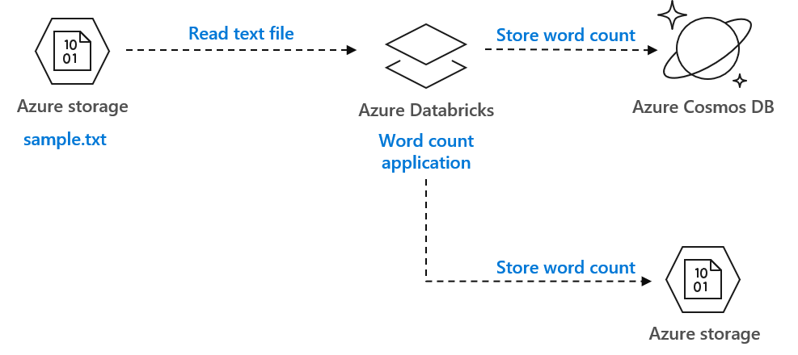
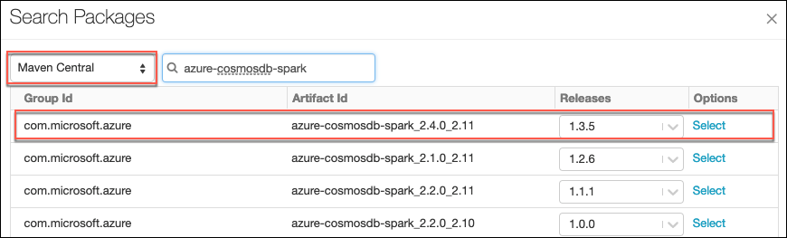

# Azure Databricks integration with Cosmos DB: hands-on lab

This guide will help you spin up an environment to test the integration between Azure Databricks, Azure Data Lake Storage and Azure Cosmos DB.

The environment is created by using Terraform, and a notebook is provided to showcase a sample Spark application that count words from a text file stored in Azure Data Lake Storage and writes the output to Azure Cosmos DB.

The diagram below shows the logical architecture of the solution.
   
   </img>

Azure Databricks data plane resources are deployed in a virtual network (sometimes called [VNet injection](https://docs.azuredatabricks.net/administration-guide/cloud-configurations/azure/vnet-inject.html)), enabling you to:
   - Connect Azure Databricks to other Azure services (such as Azure Storage) in a more secure manner using service endpoints.
   - Connect to on-premises data sources for use with Azure Databricks, taking advantage of user-defined routes.
   - Connect Azure Databricks to a network virtual appliance to inspect all outbound traffic and take actions according to allow and deny rules.
   - Configure Azure Databricks to use custom DNS.
   - Configure network security group (NSG) rules to specify egress traffic restrictions.

Deploying Azure Databricks data plane resources in a virtual network also lets you take advantage of flexible CIDR ranges (anywhere between /16-/24 for the virtual network and between /18-/26 for the subnets).

The following pictures illustrates the deployment of the solution.

   

# Run Terraform and setup the environment

## Requirements

1. Microsoft Azure subscription
2. A CI server to run Terraform non-interactively, with a Service Principal (which is an application within Azure Active Directory); or
3. If you plan to run Terraform from your local machine, install:
   - The [Azure CLI](https://docs.microsoft.com/en-us/cli/azure/install-azure-cli?view=azure-cli-latest)
   - [Terraform](https://www.terraform.io)

## Create a Service Principal on your local machine using the Azure CLI

Firstly, login to the Azure CLI using:
```shell
$ az login
```
Once logged in - it's possible to list the Subscriptions associated with the account via:
```shell
$ az account list
```

The output will display one or more Subscriptions - with the `id` field being the `SUBSCRIPTION_ID` field referred to in the scripts below.

Should you have more than one Subscription, you can specify the Subscription to use via the following command:
```shell
$ az account set --subscription="SUBSCRIPTION_ID"
```

We can now create the Service Principal which will have permissions to manage resources in the specified Subscription using the following command:
```shell
$ az ad sp create-for-rbac --role="Contributor" --scopes="/subscriptions/SUBSCRIPTION_ID"
```

This command will output a few values that must be mapped to the Terraform variables. Take note of them because you will need them in the following section:
- `appId` is the `client_id`
- `password` is the `client_secret`
- `tenant` is the `tenant_id`

Finally, since we're logged into the Azure CLI as a Service Principal we recommend logging out of the Azure CLI:
```shell
$ az logout
```

## Configure the Service Principal in Terraform

Store the credentials obtained in the previous step as environment variables:
```shell
$ export ARM_CLIENT_ID=<APP_ID>
$ export ARM_CLIENT_SECRET=<PASSWORD>
$ export ARM_SUBSCRIPTION_ID=<SUBSCRIPTION_ID>
$ export ARM_TENANT_ID=<TENANT>
```

## Run Terraform to create the environment

Modify the project file `poc.tfvars` to enter the values that are right for the deployment of the environment in your Azure subscription:
```
project_name              = <PROJECT_NAME>
project_location          = <AZURE_REGION_TO_DEPLOY_THE_PROJECT>
vnet_address_space        = <ADDRESS_SPACE_OF_THE_VNET_TO_BE_CREATED>
adb_public_subnet_prefix  = <DATABRICKS_PUBLIC_SUBNET_ADDRESS_RANGE>
adb_private_subnet_prefix = <DATABRICKS_PRIVATE_SUBNET_ADDRESS_RANGE>
```
   > **Note**: ensure that the value of the project name is maximum 16 characters in length, othwerwise some resources will not be created properly (as their names will exceed the maximum allowed length).

Run Terraform:
```shell
$ terraform init
$ terraform apply -var-file=poc.tfvars
```

When the execution of the Terraform plan has completed (expect about 10-15 minutes), verify that the required services have been successfully created:

1. Sign in to the [Azure Portal](https://portal.azure.com).

2. In the left pane, select **Resource groups**. If you don't see the service listed, select **All services**, and then select **Resource groups**.

3. You should see a resource group named `<PROJECT_NAME>-poc-rg` (eg. `datainsights-poc-rg`).

4. Click on it and observe that the following services have been created:
   - `<PROJECT_NAME>poc<#>`: the **Azure Cosmos DB account**, where we will host the database of our sample application.
   - `<PROJECT_NAME>poc<#>`: the Azure Data Lake **Storage account** (Gen2), that the sample application will read the data from and write the data to.
   - `<PROJECT_NAME>poc<#>`: the Azure **Key vault** service that will store the secrets our application uses to access the Cosmos DB and the Storage accounts.
   - `<PROJECT_NAME>-poc-vnet`: the **virtual network** (with subnets) where Azure Databricks service components and Spark workers are deployed.
   - `<PROJECT_NAME>-poc-nsg`: the **network security group** (created by Azure Databricks) associated to the subnets.
   - `<PROJECT_NAME>-poc-workspace`: the **Azure Databricks** workspace, which we will utilize to start our Spark clusters and run our sample application.

## Copy the Terraform output variables

Terraform outputs a few variables that you need to configure Azure Databricks.

Copy the **key_vault_uri** and **key_vault_id** property values and paste them to Notepad or some other text application that you can reference later. These values will be used in the next section.

You can also reproduce the values with the following commands:
```shell
$ terraform output key_vault_uri
$ terraform output key_vault_id
```

## Create the Cosmos DB database

1. Return to the [Azure portal](https://portal.azure.com).

2. Navigate to the newly provisioned Azure Cosmos DB account (`<PROJECT_NAME>poc<#>`), then select **Firewalls and virtual networks** on the left-hand menu.

3. Click on the **Add my current IP** link and then select the **Save** button.

   

   > **Note**: Please review the the client IP address that is displayed by the Portal and validate if this is your correct public IP address. If not, explicitly enter your public IP address in the textbox under the link.

   > **Important**: You may have to wait a couple of minutes before proceeding with the next instructions, to ensure that the firewall rules are indeed updated and have taken effect. If not, you may experience an authorization error when creating the Cosmos DB database.

4. Select **Data Explorer** on the left-hand menu.

   

5. Select **New Collection** in the top toolbar.

   

6. In the **Add Collection** blade, configure the following:

   - **Database id**: Select **Create new**, then provide an ID for the database (such as `WordCount`), that we will refer to as `<DATABASE_ID>` in the Azure Databricks notebook we will setup.
   - **Provision database throughput**: Unchecked.
   - **Collection id**: Enter "words".
   - **Partition key**: Enter "/word".
   - **Throughput**: Enter 1000.

   

7. Click on the **OK** button to create the collection.

## Configure Azure Databricks to access Key Vault

Connect to your Azure Databricks workspace and configure Azure Databricks secrets to use your Azure Key Vault account as a backing store.

1. Return to the [Azure portal](https://portal.azure.com), navigate to the Azure Databricks workspace you provisioned above (`<PROJECT_NAME>-poc-workspace`), and select **Launch Workspace** from the overview blade, signing into the workspace with your Azure credentials, if required.

   

2. In your browser's URL bar, append **#secrets/createScope** to your Azure Databricks base URL (for example, <https://southeastasia.azuredatabricks.net#secrets/createScope>).

3. Enter `key-vault-secrets` for the name of the secret scope.

4. Select **Creator** within the Manage Principal drop-down to specify only the creator (which is you) of the secret scope has the MANAGE permission.

5. Enter:
   - **DNS Name**: the `key_vault_uri` value output by Terraform (for example, <https://datainsightspocvault.vault.azure.net/>).
   - **Resource ID**: the `key_vault_id` value output by Terraform (for example: `/subscriptions/xxxxxxxx-xxxx-xxxx-xxxx-xxxxxxxxxxxx/resourcegroups/datainsights-poc-rg/providers/Microsoft.KeyVault/vaults/datainsightspocvault`).

   

6. Select **Create**.

After a moment, you will see a dialog verifying that the secret scope has been created.

# Run the sample Spark application

## Create an Azure Databricks cluster

1. Return to the [Azure portal](https://portal.azure.com), navigate to the Azure Databricks workspace you provisioned above, and select **Launch Workspace** from the overview blade, signing into the workspace with your Azure credentials, if required.

2. Select **Clusters** from the left-hand navigation menu, and then select **+ Create Cluster**.

   

3. On the Create Cluster screen, enter the following:

   - **Cluster Name**: Enter a name for your cluster, such as `lab-cluster`.
   - **Cluster Mode**: Select Standard.
   - **Databricks Runtime Version**: Select Runtime: **5.1** (Scala 2.11, Spark 2.4.0).
   - **Python Version**: Select 3.
   - **Enable autoscaling**: Ensure this is checked.
   - **Terminate after XX minutes of inactivity**: Leave this checked, and the number of minutes set to 120.
   - **Worker Type**: Select Standard_DS4_v2.
     - **Min Workers**: Leave set to 2.
     - **Max Workers**: Leave set to 8.
   - **Driver Type**: Set to Same as worker.
   - Expand Advanced Options and enter the following into the Spark Config box:

   ```bash
   spark.databricks.delta.preview.enabled true
   ```

   

4. Select **Create Cluster**.

5. Wait for the cluster to be running, before proceeding to the next section. It will take **3-5 minutes** for the cluster to be created and started.

## Install the Azure Cosmos DB Spark Connector

You have to install the [Azure Cosmos DB Spark Connector](https://github.com/Azure/azure-cosmosdb-spark) on your Databricks cluster: it allows you to easily read from and write to Azure Cosmos DB via Apache Spark DataFrames.

1. Navigate to your Azure Databricks workspace in the [Azure portal](https://portal.azure.com/), and select **Launch Workspace** from the overview blade, signing into the workspace with your Azure credentials, if required.

2. Select **Workspace** from the left-hand menu, then select the drop down arrow next to **Shared** and select **Create** and **Library** from the context menus.

   

3. On the Create Library page, select **Maven** under Library Source, and then select **Search Packages** next to the Coordinates text box.

   

4. On the Search Packages dialog, select **Maven Central** from the source drop down, enter **azure-cosmosdb-spark** into the search box, and click **Select** next to Artifact Id `azure-cosmosdb-spark_2.4.0_2.11` release `1.3.5`.

   

5. Select **Create** to finish installing the library.

   

6. On the following screen, check the box for **Install automatically on all clusters**, and select **Confirm** when prompted.

   

## Open Azure Databricks and load lab notebooks

Follow the instructions below to download the notebook contained in this repository and upload it to your Azure Databricks workspace.

1. Download the notebook from the following link: [CosmosDB-WordCount-Sample-Application.ipynb](https://github.com/alagala/labs/blob/master/azure/databricks/notebooks/CosmosDB-WordCount-Sample-Application.ipynb)

2. Navigate to your Azure Databricks workspace in the Azure portal, and select **Launch Workspace** from the overview blade, signing into the workspace with your Azure credentials, if required.

3. Select **Workspace** from the left-hand menu, then select **Users** and select your user account (email address), and then select the down arrow on top of your user workspace and select **Import** from the context menu.

   

4. Within the Import Notebooks dialog, select **File** for Import from, and then drag-and-drop the downloaded `ipynb` file into the box, or browse to upload it.

   

5. Select **Import**.

6. You should now see a notebook named **CosmosDB-WordCount-Sample-Application** in your user workspace.

7. In the **CosmosDB-WordCount-Sample-Application** notebook, follow the instructions to execute the Spark application.

## Explore the data in Cosmos DB

1. Return to the [Azure portal](https://portal.azure.com).

2. Navigate to the Azure Cosmos DB account (`<PROJECT_NAME>poc<#>`), then select **Data Explorer** on the left-hand menu.

3. Expand the database and collection you created earlier, and click on **Documents**.

   

4. You should be able to see the list of word counts stored in Cosmos DB by Azure Databricks. Selecting any of the documents will display the detailed properties.

# Cleanup the allocated resources

## Run Terraform to destroy the environment
Run the following Terraform command to cleanup all allocated resources and destroy the environment:
```shell
$ terraform destroy
```

   > **Note**: at the moment, [an issue](https://github.com/terraform-providers/terraform-provider-azurerm/issues/3226) with the Terraform provider for Azure Resource Manager prevents the Azure Data Lake Storage account to be destroyed.
   > *Hence, for the time being, it's best to delete the resource group from the [Azure portal](https://portal.azure.com).*