# Use a cloud-based notebook server to get started with Azure Machine Learning

Create a cloud-based notebook server, then use it.  In this lab, you run Python code through a notebook server that you deploy in the [Azure Machine Learning service](https://docs.microsoft.com/en-us/azure/machine-learning/service/) workspace. The workspace is the foundational block in the cloud that you use to experiment, train, and deploy machine learning models with Machine Learning. 

In this lab, you take the following actions:

* Create a new cloud-based notebook server in your workspace.
* Launch the Jupyter web interface.
* Open a notebook that contains code with classification and regression tasks.
* Run the notebook.
* Understand the fundamentals of the Azure Machine Learning service.
* Run automated machine learning experiments (AutoML). 

If you don’t have an Azure subscription, create a free account before you begin. Try the [free or paid version of Azure Machine Learning service](https://aka.ms/AMLFree) today.

## Create a workspace

If you have an Azure Machine Learning service workspace, skip to the [next section](#create-a-cloud-based-notebook-server). Otherwise, create one now.

1. Sign in to the [Azure portal](https://portal.azure.com/) by using the credentials for the Azure subscription you use. 

   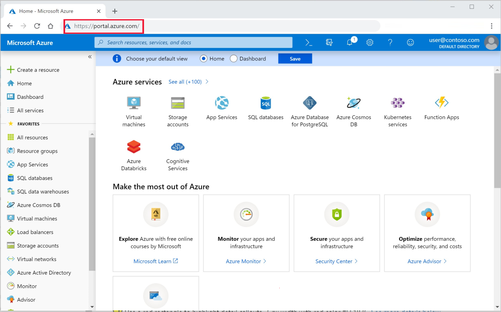

1. In the upper-left corner of the portal, select **Create a resource**.

   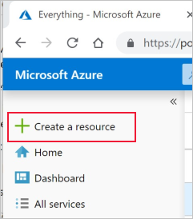

1. In the search bar, enter **Machine Learning**. Select the **Machine Learning service workspace** search result.

   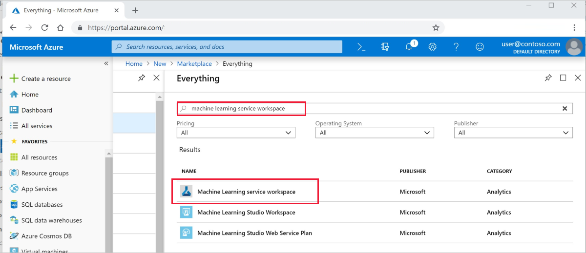

1. In the **ML service workspace** pane, scroll to the bottom and select **Create** to begin.

   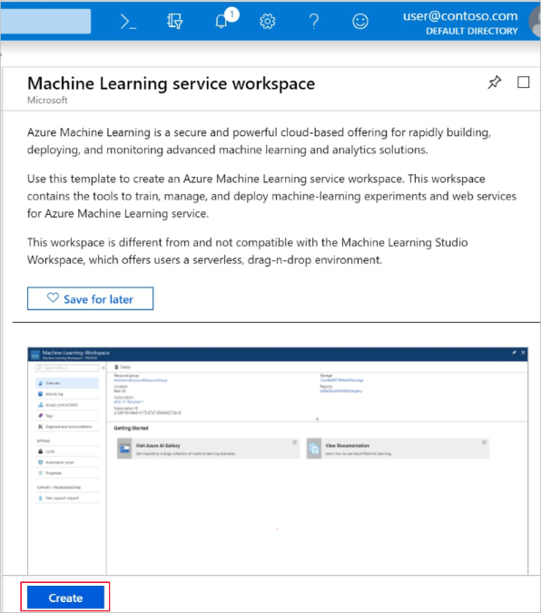

1. In the **ML service workspace** pane, configure your workspace.

   Field|Description
   ---|---
   Workspace name |Enter a unique name that identifies your workspace. In this example, we use **docs-ws**. Names must be unique across the resource group. Use a name that's easy to recall and differentiate from workspaces created by others.  
   Subscription |Select the Azure subscription that you want to use.
   Resource group | Use an existing resource group in your subscription, or enter a name to create a new resource group. A resource group is a container that holds related resources for an Azure solution. In this example, we use **docs-aml**. 
   Location | Select the location closest to your users and the data resources. This location is where the workspace is created.

   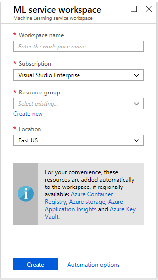

1. To start the creation process, select **Create**. It can take a few moments to create the workspace.

1. To check on the status of the deployment, select the Notifications icon, **bell**, on the toolbar.

1. When the process is finished, a deployment success message appears. It's also present in the notifications section. To view the new workspace, select **Go to resource**.

   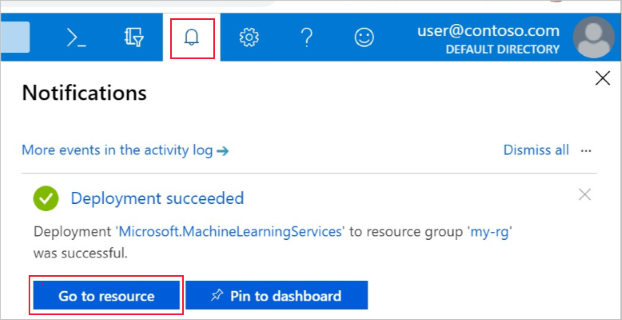

## Create a cloud-based notebook server

 From your workspace, you create a cloud resource to get started using Jupyter notebooks. This resource gives you a cloud-based platform pre-configured with everything you need to run Azure Machine Learning service.

1. Open your workspace in the [Azure portal](https://portal.azure.com/).

1. On your workspace page in the Azure portal, select **Notebook VMs** on the left.

1. Select **+New** to create a notebook VM.

     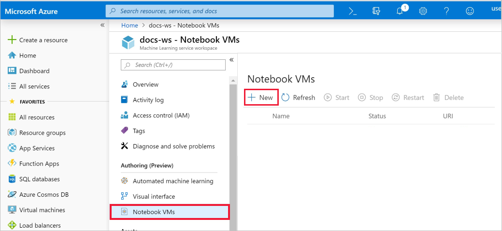

1. Provide a name for your VM. Then select **Create**.

    > [!NOTE]
    > Your Notebook VM name must be between 2 to 16 characters. Valid characters are letters, digits, and the - character.  The name must also be unique across your Azure subscription.

    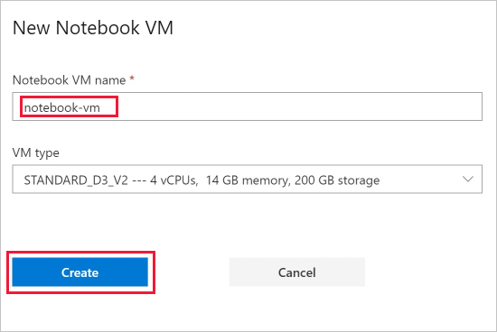

1. Wait approximately 4-5 minutes, until the status changes to **Running**.

### Launch Jupyter web interface

After your VM is running, use the **Notebook VMs** section to launch the Jupyter web interface.

1. Select **Jupyter** in the **URI** column for your VM.  

    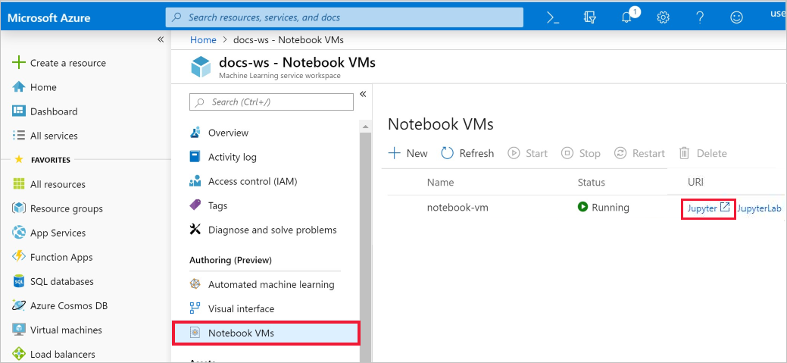

    The link starts your notebook server and opens the Jupyter notebook webpage in a new browser tab.  This link will only work for the person who creates the VM.

1. On the Jupyter notebook webpage, the top foldername is your username.  Select this folder.

1. The samples foldername includes a version number, for example **samples-1.0.33.1**.  Select the samples folder.

1. Select the **tutorial** notebook.

### Run the image classification notebooks

Run a notebook that performs a simple logistic regression using the `MNIST` dataset and `scikit-learn`.

1. Select **img-classification-part1-training.ipynb** to open the notebook.

1. Click into the first code cell and select **Run**.

    > Code cells have brackets before them. If the brackets are empty (__[  ]__), the code has not been run. While the code is running, you see an asterisk(__[*]__). After the code completes, a number **[1]** appears.  The number tells you the order in which the cells ran.
    >
    > Use **Shift-Enter** as a shortcut to run a cell.

1. Run the second code cell. If you see instructions to authenticate, copy the code and follow the link to sign in. Once you sign in, your browser will remember this setting.  

    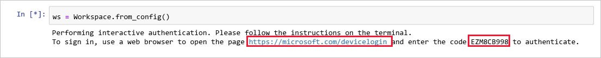

1. When complete, the cell number __[2]__ appears.  If you had to sign in, you will see a successful authentication status message.   If you didn't have to sign in, you won't see any output for this cell, only the number appears to show that the cell ran successfully.

    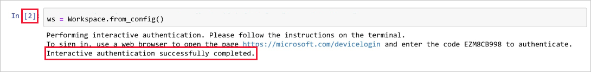

1. Run the rest of the code cells.  As each cell finishes running, you will see its cell number appears.

    > As you walk through each cell, spend some time to understand the code reading the comments and the [Azure Machine Learning service documentation](https://docs.microsoft.com/en-us/azure/machine-learning/service/), or ask for clarifications to the instructor if you are performing these steps in a classroom.

1. When you have done, select **img-classification-part2-deploy.ipynb** to open the notebook.

1. Run all code cells.

### Run the regression notebooks that demonstrate the Automated Machine Learning feature

Run notebooks that generate a regression model to predict taxi fare prices. By using the automated machine learning capabilities of the service, you define your machine learning goals and constraints. You launch the automated machine learning process. Then allow the algorithm selection and hyperparameter tuning to happen for you. The automated machine learning technique iterates over many combinations of algorithms and hyperparameters until it finds the best model based on your criterion.

1. Select **regression-part1-data-prep.ipynb** to open the notebook.

1. Run all of the code cells.  As each cell finishes running, you will see its cell number appears. 

    > As you walk through each cell, spend some time to understand the code reading the comments and the [Azure Machine Learning service documentation](https://docs.microsoft.com/en-us/azure/machine-learning/service/), or ask for clarifications to the instructor if you are performing these steps in a classroom.

1. When you have done, select **regression-part2-automated-ml.ipynb** to open the notebook.

1. Run all code cells.

## Clean up resources

### Stop the notebook VM

Stop the notebook VM when you are not using it to reduce cost.  

1. In your workspace, select **Notebook VMs**.

   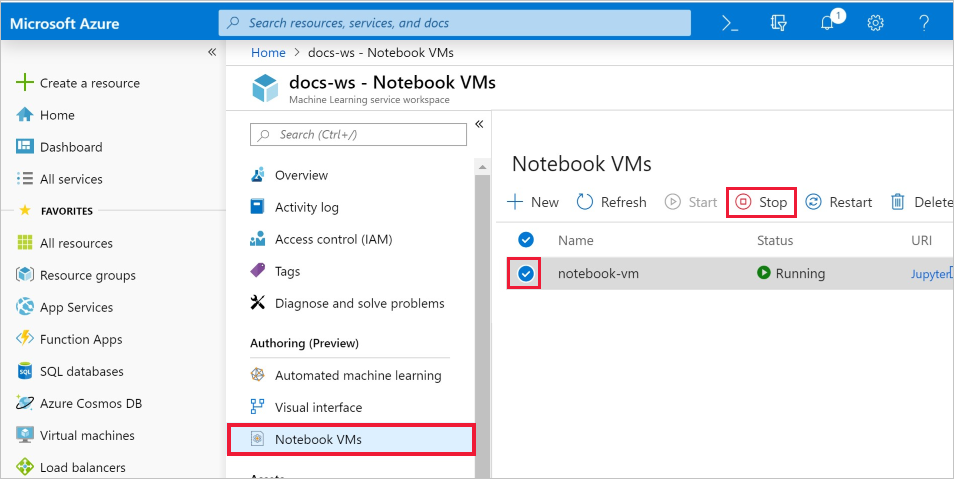

1. From the list, select the VM.

1. Select **Stop**.

1. When you're ready to user the server again, select **Start**.

### Delete everything

If you don't plan to use the resources you created, delete them, so you don't incur any charges:

1. In the Azure portal, select **Resource groups** on the far left.
 
   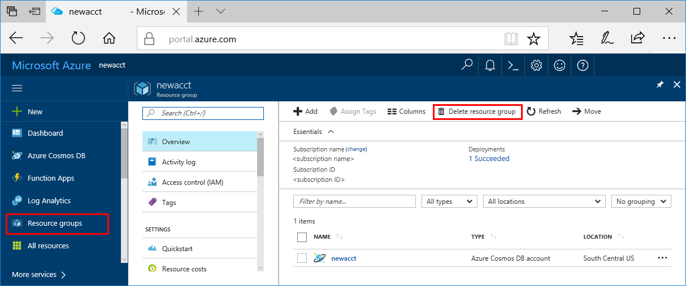

1. From the list, select the resource group you created.

1. Select **Delete resource group**.

1. Enter the resource group name. Then select **Delete**.